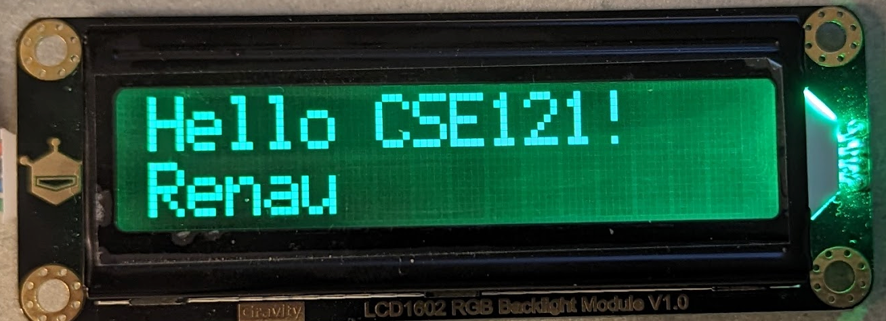
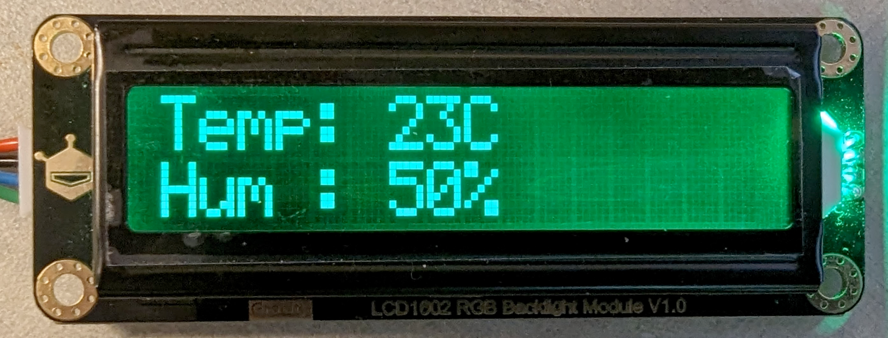

# Lab 3 - Display Humidity and Temperature

Due Date: Wed 10/30/2024

This lab is worth 20 Points. The overall objective of this task is to develop a
new C++ library in ESP32 to control the display (I2C) and use the same I2C to
access the temperature/humidity sensor.

It is VERY important to submit the **report.pdf** file. If this
file is missing, you lose 1⁄2 of the points.

## Lab3.1: Solder pins (5 points)

You must solder the pin headers to the ESP32 board. This for the I2C and Vdd
control for the display.

## Lab3.2: Display library (10 points)

You can clone the <https://github.com/DFRobot/DFRobot_RGBLCD1602>. This library was
for Arduino, but we have an ESP32C3, so it does not work. The idea is to
respect the same API (DFRobot_LCD.h) but to completely rework the internals
(only use ESP32 calls like we have been doing during class). Some hints:

* This is a C++ library, so the ESP32 project should be C++.
* The Print should be removed.
* The Wire should be replaced with the ESP32 "sort of equivalent"

Once your project is done, it should print "Hello CSE121!" in the 1st line and the 2nd show your last name.



The app main should look like this (not exactly this, change the name).

```c
while (true) {
  lcd.init();

  lcd.setRGB("Hello CSE121!");
  lcd.setCursor(0, 1);
  lcd.printstr("Renau");
}
```

## Lab3.3: Integrate humidity and temperature (5 points)

Using the display, read the humidity sensor and the temperature. It should show the temperature in Celcius (1st line). The value should be updated each second.



## What/How to submit

Same instructions as lab1. Upload the zip with the code but without the build
subdirectory and a report.pdf to Gradescope.

Submit the following directories:

* lab3_2/*
* lab3_3/*
